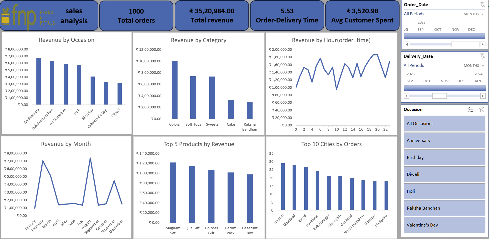
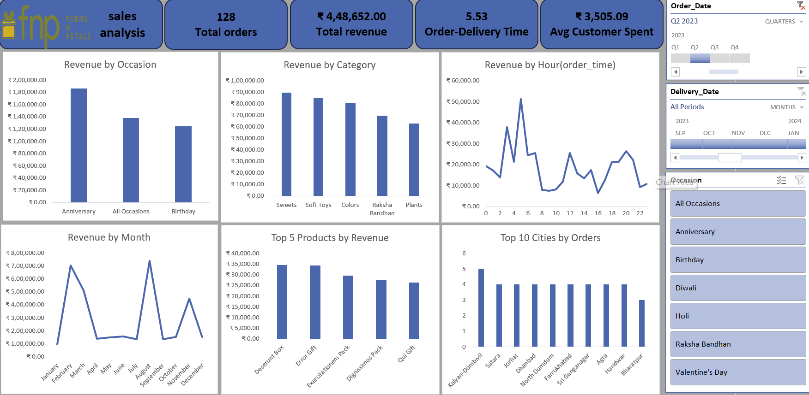
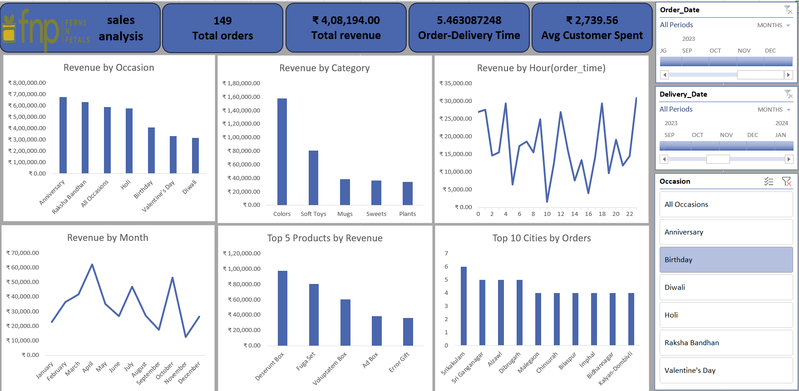

# E-Commerce Sales Performance & Growth Strategy

## Project Overview
Analyzed 1,000 e-commerce transactions to identify seasonal revenue trends, evaluate logistical efficiency, and model actionable growth strategies. 

*Note: Data was extracted and transformed from multiple raw files via Power Query. Local folder path connections have been preserved in the workbook for structural review.*

## Key Business Insights

* **Seasonal Revenue Crater:** Total revenue dropped 65% from Q1 (₹13,11,800.00) to Q2 (₹4,48,652.00) due to a heavy reliance on festival periods.
* **Unmonetized Urgency:** Fulfillment averages a flat 5.53 days across the board, even for high-urgency "Birthday" occasions which yield the business's lowest Average Order Value (AOV) at ₹2,739.56.
* **Single-Category Dependence:** Checkout carts are tied directly to specific holidays (e.g., "Colors" in Q1, "Sweets" in Q4), keeping the overall baseline AOV stagnant at ₹3,520.98.

## Strategic Recommendations

1. **Neutralize the Q2 Drop:** Shift Q2 marketing spend entirely toward Anniversary campaigns. While Q2 lacks major festivals, Anniversary shoppers consistently deliver the highest AOV of the year (₹4,652.19). 
    * *Visual Proof: Q2 Drop*
    

2. **Implement Tiered Shipping:** Introduce high-margin 24-hour and 48-hour expedited shipping tiers to extract profit from time-sensitive, low-spend Birthday shoppers.
    * *Visual Proof: Birthday Occasion Low AOV & Flat Delivery*
    

3. **Dynamic Checkout Bundling:** Implement mandatory "Add a Soft Toy" cross-sell prompts to leverage their proven year-round demand and immediately inflate the baseline AOV.

## Repository Files

* [customers.csv](Data/customers.csv)
* [orders.csv](Data/orders.csv)
* [products.csv](Data/products.csv)
* [Ecommerce_Sales_Strategy_Dashboard.xlsx](Ecommerce_Sales_Strategy_Dashboard.xlsx)

## Technical Stack
* **Tool:** Microsoft Excel
* **Techniques:** Power Query (Data Extraction & Transformation from Folder), Data Modeling, Pivot Tables, Advanced Charting, Dynamic Dashboard Design, Report Connections.
